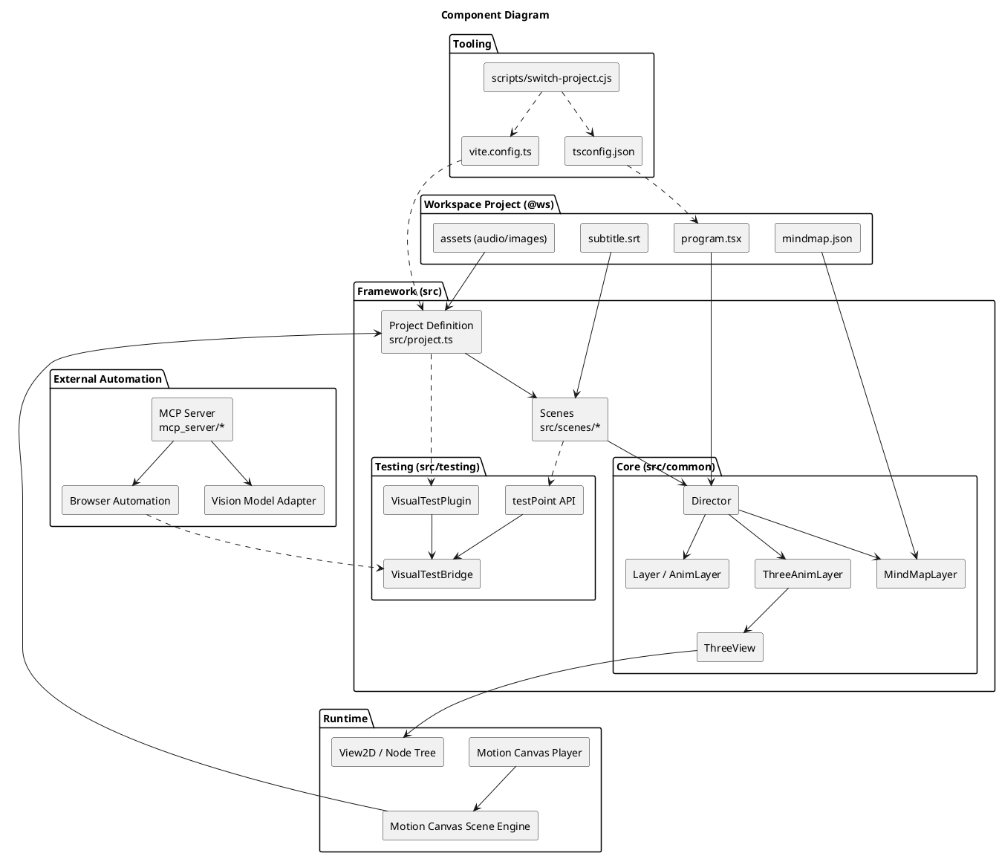
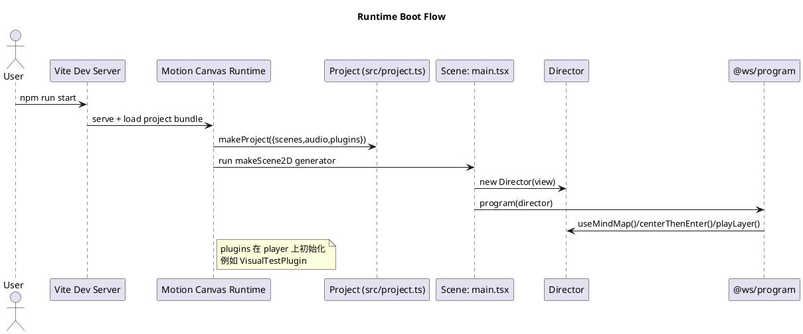
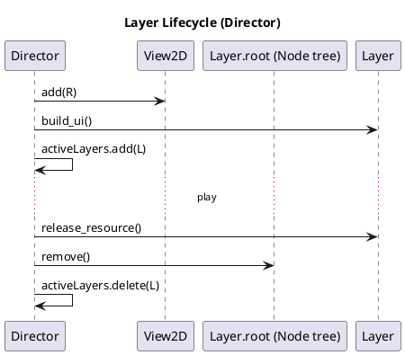
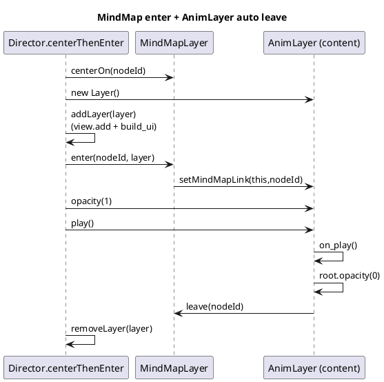
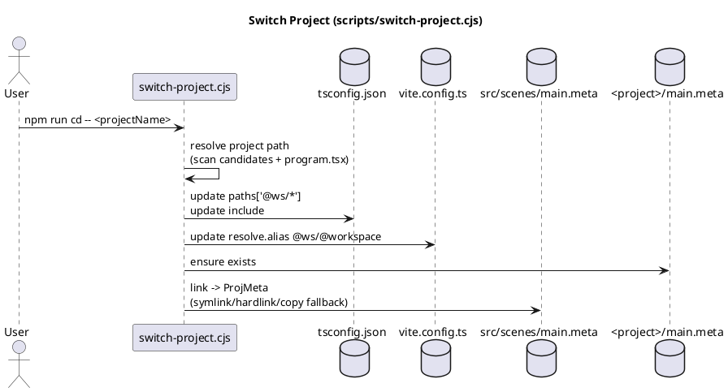

# How It Work：Motion Canvas 科普动画框架架构

本仓库是一个基于 Motion Canvas 的科普视频动画工程框架：用可复用的 Layer 抽象组织讲解内容，用 Director 统一编排转场/叠放，用 `@ws/*` 机制把“当前项目”接入到同一套框架中，并提供视觉测试插件与 MCP Server 方便自动化回归。

## 目标与边界

- 目标：用一致的讲解风格快速搭建动画内容；降低项目切换成本；提供可自动化验证的测试点机制。
- 非目标：把所有动画都抽象成可视化 UI 编辑器；当前主要通过代码驱动动画生成器来编排时间线。

## 关键概念

### Scene（场景）

- Motion Canvas 的运行单元：每个 `makeScene2D` 返回一个生成器函数，按帧推进执行动画。
- 本仓库默认场景入口见 [main.tsx](file:///d:/WorkSpace/src/how_it_work/src/scenes/main.tsx)。

### Director（导演/编排器）

Director 管理 View2D 上的 Layer 生命周期与常用转场套路：

- `addLayer/removeLayer`：把 Layer 的 `root` 挂到 View2D，并负责构建与销毁。
- `centerThenEnter`：以思维导图节点为锚点，完成聚焦→展开节点→淡入内容→播放→清理的流程。
- `playLayer`：不依赖思维导图的淡入→播放→淡出→清理流程。

实现见 [director.ts](file:///d:/WorkSpace/src/how_it_work/src/common/director.ts)。

### Layer / AnimLayer（内容层）

- `Layer`：统一“可挂到 View2D 的节点树 + 生命周期”协议：`root/build_ui/play/release_resource`。
- `BaseLayer`：默认提供空 `root: Node` 与资源释放。
- `AnimLayer`：增加与思维导图联动的“自动退场”能力：若被 MindMapLayer 链接，则在 `play()` 结束时自动 `fade out + mindmap.leave(nodeId)`。

实现见 [layer.ts](file:///d:/WorkSpace/src/how_it_work/src/common/layer.ts)、[animLayer.ts](file:///d:/WorkSpace/src/how_it_work/src/common/animLayer.ts)。

### MindMapLayer（讲解地图/章节导航）

MindMapLayer 负责把 `mindmap.json` 渲染为 2D 导图，并提供：

- `snapTo/centerOn/scale`：移动/缩放整张导图。
- `enter/leave`：以某个节点为锚点做“节点展开占屏 + 隐藏其他节点 + 边淡出/淡入”的转场。
- `enter` 内部会将目标 Layer 通过 `setMindMapLink` 注入，从而触发 `AnimLayer` 的自动退场。

实现见 [mindmap.tsx](file:///d:/WorkSpace/src/how_it_work/src/common/mindmap.tsx)。

### Workspace Project（项目工作区 / @ws）

仓库把“具体一期视频/一个主题内容”组织为一个 project 目录（例如 `projects/math_la_matrix_multiply`），并通过 `@ws/*` 让框架代码稳定引用项目产物：

- `@ws/program`：导出 `program(director)` 与 `audio` 等资产入口。
- `@ws/mindmap.json`、`@ws/subtitle.srt` 等：项目特有内容。

当前项目切换脚本会自动改写 `tsconfig.json` 与 `vite.config.ts` 的 alias，并处理 `src/scenes/main.meta` 到项目 `main.meta` 的链接，见 [switch-project.cjs](file:///d:/WorkSpace/src/how_it_work/scripts/switch-project.cjs)。

### Visual Testing（视觉测试）

视觉测试由两部分组成：

- 浏览器侧：Motion Canvas 插件在运行时挂载全局桥接对象 `window.__MC_VISUAL_TEST__`，场景内通过 `testPoint(name, ...)` 注册测试点。
- 外部侧：MCP Server 通过浏览器自动化打开页面→读取测试点→跳转并截图→交给视觉模型/规则做检查。

入口见 [visualTestPlugin.ts](file:///d:/WorkSpace/src/how_it_work/src/testing/visualTestPlugin.ts)、[visualTestPoint.ts](file:///d:/WorkSpace/src/how_it_work/src/testing/visualTestPoint.ts)、[visualTestBridge.ts](file:///d:/WorkSpace/src/how_it_work/src/testing/visualTestBridge.ts)，说明文档见 [visual-testing.md](file:///d:/WorkSpace/src/how_it_work/docs/visual-testing.md)。

## 组件图

## 运行与数据流

### 运行链路（从启动到执行 program）

### Layer 生命周期（Director 视角）

### 思维导图联动（enter / auto leave）

## Three.js 3D 集成（3DAnimLayer）

本仓库将 Three.js 作为一种“特殊 Layer”接入：其动画完全由代码驱动，不需要额外的编辑器 UI。

核心思路：

- `ThreeView` 继承自 Motion Canvas 的 `Layout`，重写 `draw(context)`：
  - 根据节点 `size()` 调整 WebGLRenderer 的尺寸与相机 aspect
  - 调用 `renderer.render(scene,camera)`
  - 将 `renderer.domElement`（离屏 canvas）通过 `context.drawImage` 合成到 2D 画布
- `ThreeAnimLayer` 继承 `AnimLayer`，在 `on_build_ui()` 中把 `ThreeView` 添加到 `root`，并留出 `on_setup_scene()` 与 `on_play_3d()` 给子类实现。

实现见：

- [ThreeView.tsx](file:///d:/WorkSpace/src/how_it_work/src/common/three/ThreeView.tsx)
- [ThreeAnimLayer.ts](file:///d:/WorkSpace/src/how_it_work/src/common/three/ThreeAnimLayer.ts)
- 示例层：`projects/math_la_matrix_multiply/three_basic.tsx` [three_basic.tsx](file:///d:/WorkSpace/src/how_it_work/projects/math_la_matrix_multiply/three_basic.tsx)

## 项目切换机制（@ws alias）

## 目录与职责（建议阅读顺序）

- `src/project.ts`：Motion Canvas project 配置（场景、音频、插件）[project.ts](file:///d:/WorkSpace/src/how_it_work/src/project.ts)
- `src/scenes/main.tsx`：默认主场景，创建 Director 并并行运行字幕与 program [main.tsx](file:///d:/WorkSpace/src/how_it_work/src/scenes/main.tsx)
- `src/common/*`：框架核心抽象（Director、Layer、MindMap、Three）[director.ts](file:///d:/WorkSpace/src/how_it_work/src/common/director.ts)
- `projects/<name>/*`：一期内容的资产与编排脚本（program、mindmap、subtitle 等）
- `src/testing/*` + `docs/visual-testing.md`：视觉测试机制
- `mcp_server/*`：外部自动化检查（浏览器驱动 + 视觉模型适配）

## 扩展指南（新增一个讲解模块）

- 在某个 project 目录下新增一个 `AnimLayer` 子类（2D）或 `ThreeAnimLayer` 子类（3D）。
- 在 `program.tsx` 中按需：
  - 如果是章节导图驱动：`yield* director.centerThenEnter(mindmap, nodeId, LayerClass)`
  - 如果是纯转场：`yield* director.playLayer(LayerClass)`
- 若需要视觉回归点：在场景 generator 中调用 `testPoint('xxx')`。
